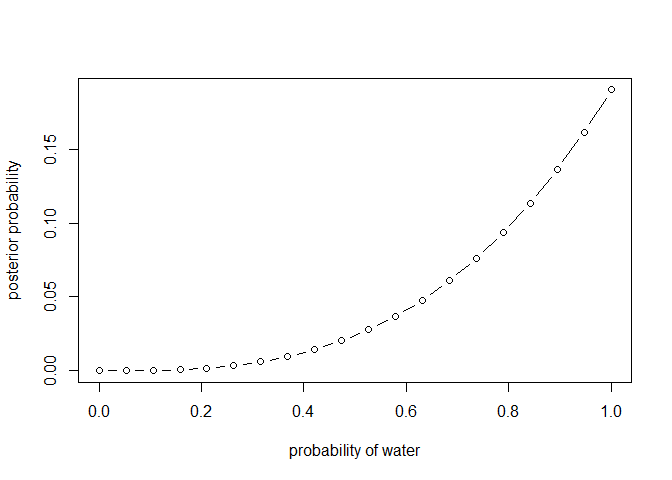
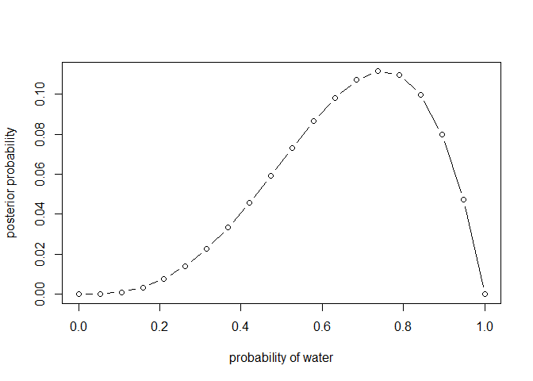
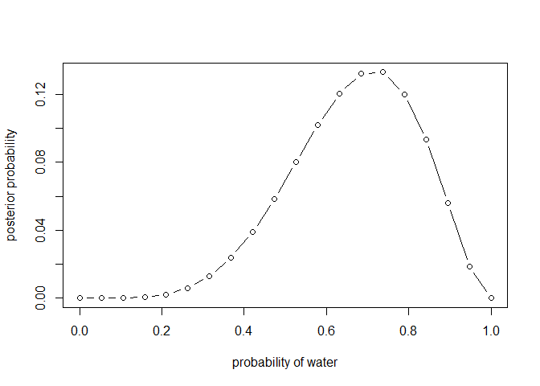
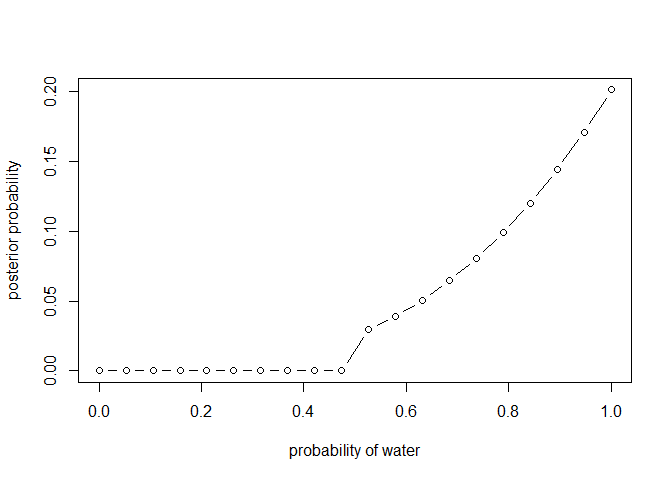
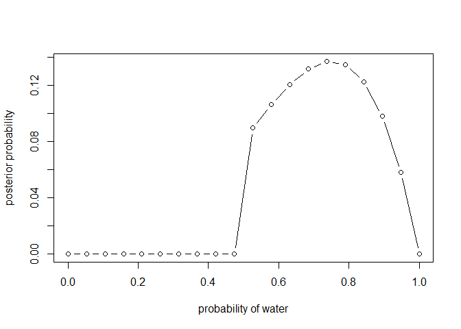
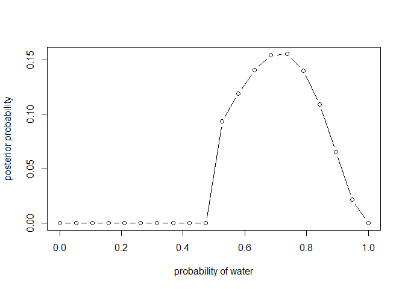

# Chapter 2

## 2E1
Which of the expressions below correspond to the statement: the probability of rain on Monday?  
**Pr(rain|Monday)**  
You observed that it is Monday, what is the probability that it's raining?  
**Pr(rain, Monday)/Pr(Monday)** means the same as above


## 2E2
Which of the following statements corresponds to the expression: Pr(Monday|rain)?  
**The probability that it is Monday, given that it is raining.**

## 2E3
Which of the expressions below corresponds to the statement: the probability that it is Monday, given that it is raining?  
**Pr(Monday|rain)**  
**Pr(rain|Monday)Pr(Monday)/Pr(rain)**

## 2M1
Recall the globe tossing model from the chapter. Compute and plot the grid approximate posterior distribution for each of the following sets of observations. In each case, assume a uniform prior for p.  
**1) W, W, W**

```r
p_grid <- seq(from = 0, to = 1, length.out = 20)
prior <- rep(1, 20)
likelihood <- dbinom(3, size = 3, prob = p_grid)
unstd.posterior <- likelihood * prior
posterior <- unstd.posterior / sum(unstd.posterior)
sum(posterior) # should sum to 1
```

```
## [1] 1
```

```r
plot(p_grid, posterior, type = "b",
     xlab = "probability of water", 
     ylab = "posterior probability")
```

<!-- -->

**2) W, W, W, L**

```r
likelihood <- dbinom(3, size = 4, prob = p_grid)
unstd.posterior <- likelihood * prior
posterior <- unstd.posterior / sum(unstd.posterior)
plot(p_grid, posterior, type = "b",
     xlab = "probability of water", 
     ylab = "posterior probability")
```

<!-- -->

**3) L, W, W, L, W, W, W**

```r
likelihood <- dbinom(5, size = 7, prob = p_grid)
unstd.posterior <- likelihood * prior
posterior <- unstd.posterior / sum(unstd.posterior)
plot(p_grid, posterior, type = "b",
     xlab = "probability of water", 
     ylab = "posterior probability")
```

<!-- -->

## 2M2
Now assume a prior for p that is equal to zero when p < 0.5 and is a positive constant when p >= 0.5. Again compute and plot the grid approximate posterior distribution for each of the sets of observations in the problem just above.  
**1) W, W, W**

```r
p_grid <- seq(from = 0, to = 1, length.out = 20)
prior <- ifelse(p_grid < 0.5, 0, 1)
likelihood <- dbinom(3, size = 3, prob = p_grid)
unstd.posterior <- likelihood * prior
posterior <- unstd.posterior / sum(unstd.posterior)
plot(p_grid, posterior, type = "b",
     xlab = "probability of water", 
     ylab = "posterior probability")
```

<!-- -->

**2) W, W, W, L**

```r
likelihood <- dbinom(3, size = 4, prob = p_grid)
unstd.posterior <- likelihood * prior
posterior <- unstd.posterior / sum(unstd.posterior)
plot(p_grid, posterior, type = "b",
     xlab = "probability of water", 
     ylab = "posterior probability")
```

<!-- -->

**3) L, W, W, L, W, W, W**

```r
likelihood <- dbinom(5, size = 7, prob = p_grid)
unstd.posterior <- likelihood * prior
posterior <- unstd.posterior / sum(unstd.posterior)
plot(p_grid, posterior, type = "b",
     xlab = "probability of water", 
     ylab = "posterior probability")
```

<!-- -->

## 2M3
Suppose there are two globes, one for Earth and one for Mars. The Earth globe is 70% covered in water. The Mars globe is 100% land. Further suppose that one of these globes - you don't know which - was tossed in the air and produced a "land" observation. Assume that each globe was equally likely to be tossed. Show that the posterior probability that the globe was the Earth, condition on seeing "land" (Pr(Earth|land)), is 0.23.

```r
prior <- c(0.5, 0.5) #equally likely to be Earth or Mars
probability <- c(0.3, 1) #probability of land for Earth or Mars
likelihood <- dbinom(1, 1, probability)
unstd.posterior <- likelihood * prior
posterior <- unstd.posterior / sum(unstd.posterior)
posterior
```

```
## [1] 0.2307692 0.7692308
```


## 2M4
Suppose you have a deck with only three cards. Each card has two sides, and each side is either black or white. One card has two black sides. The second card has one black and one white side. The third card has two white sides. Now suppose all three cards are placed in a bag and shuffled. Someone reaches into the bag and pulls out a card and places it flat on the table. A black side is shown facing up, but you don't know the color of the side facing down. Show that the probability that the other side is also black is 2/3. Use the counting method to approach this problem. This means counting up the ways that each card could produce the observed data (a black side facing up on the table).  

| Card | Face Up | Face Down | 
|------|---------|-----------|
| WW   | 0       | 0         | 
| BW   | 1       | 0         | 
| BB   | 2       | 2         |


## 2M5
Now suppose there are four cards: B/B, B/W, W/W, and another B/B. Again suppose a card is drawn from the bag and a black side appears face up. Again calculate the probability that the other side is black.

| Card | Face Up | Face Down |
|------|---------|-----------|
| WW   | 0       | 0         |
| BW   | 1       | 0         |
| BB   | 2       | 2         |
| BB   | 2       | 2         |

**Probability = 4/5**

## 2M6
Imagine that black ink is heavy, and so cards with black sides are heavier than cards with white sides. As a result, it's less liekly that a card with black sides is pulled from the bag. So again assume there are three cards: B/B, B/W, and W/W. After experimenting a number of times, you conclude that for every way to pull the B/B card from the bag, there are 2 ways to pull the B/W card and 3 ways to pull the W/W card. Again suppose that a card is pulled and a black side appears face up. Show that the probability the other side is black is now 0.5. Use the counting method, as before.

| Card | Face Up | Face Down | Weight Prior | Paths |
|------|---------|-----------|--------------|-------|
| WW   | 0       | 0         | 3            | 0     |
| BW   | 1       | 0         | 2            | 2     |
| BB   | 2       | 2         | 1            | 2     |

**Probability = 2/4 = 0.5**
