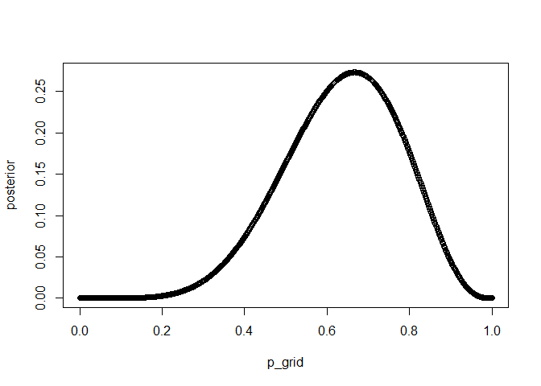
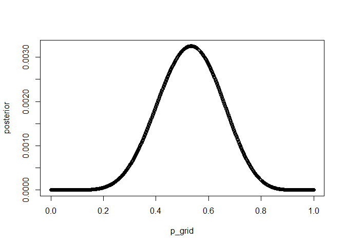
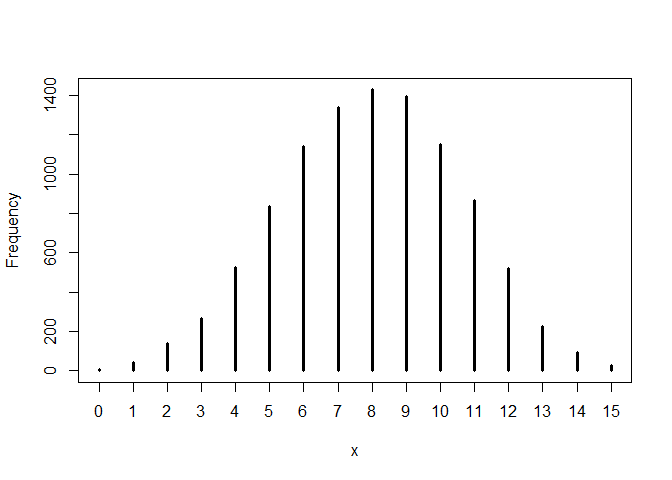
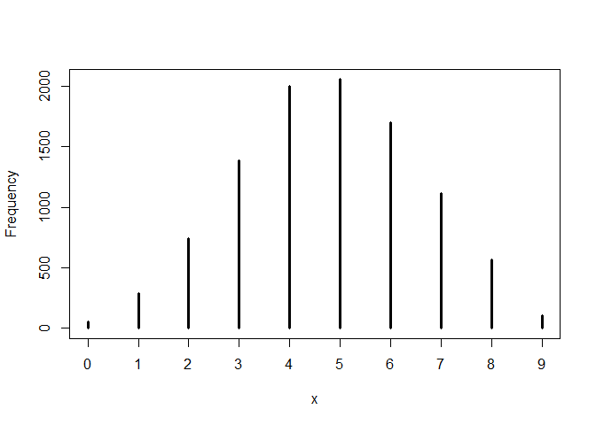
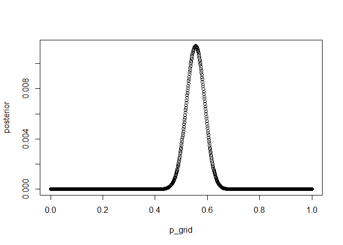
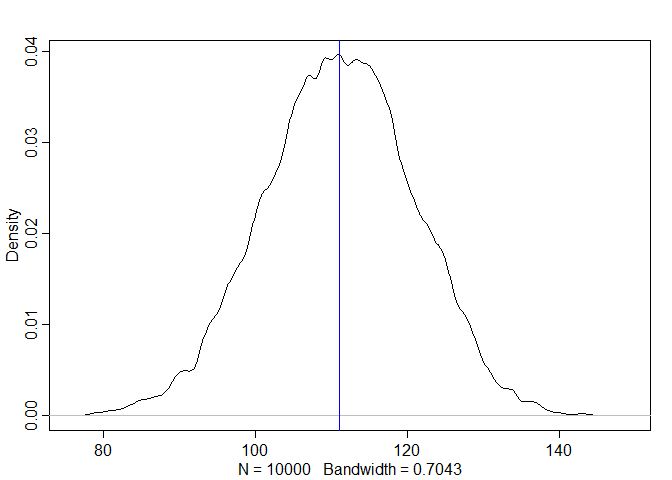
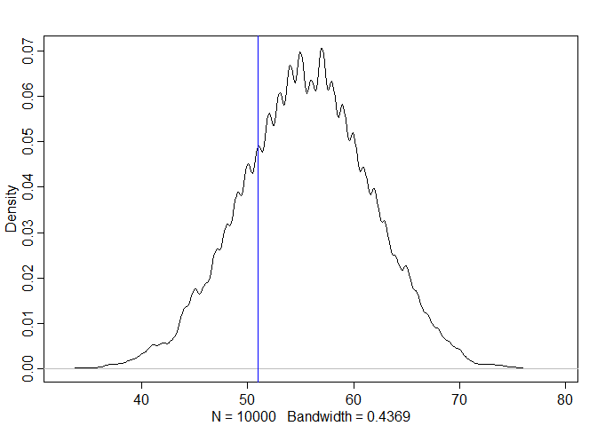
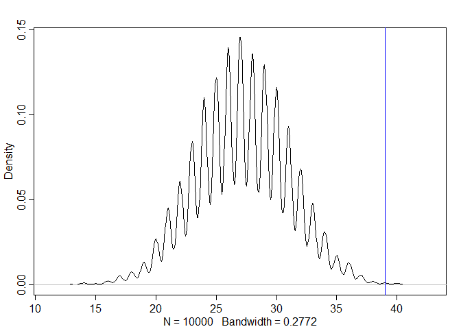

```r
library(rethinking)
```

# Easy


```r
p_grid <- seq(from = 0, to = 1, length.out = 1000)
prior <- rep(1, 1000)
likelihood <- dbinom(6, size = 9, prob = p_grid)
posterior <- likelihood * prior
set.seed(100)
samples <- sample(p_grid, prob = posterior, size = 1e4, replace = TRUE)

# plot posterior distribution
plot(p_grid, posterior, type = "b")
```

<!-- -->

## 3E1 - How much posterior probability lies below *p* = 0.2?  


```r
sum(samples < 0.2) / 1e4
```

```
## [1] 5e-04
```
0.05% of posterior probability is below *p* = 0.2.

## 3E2 - How much posterior probability lies above *p* = 0.8?


```r
sum(samples > 0.8) / 1e4
```

```
## [1] 0.1117
```
11.17% of posterior probability is above *p* = 0.8.

## 3E3 - How much posterior probability lies between *p* = 0.2 and *p* = 0.8?


```r
sum(samples > 0.2 & samples < 0.8) / 1e4
```

```
## [1] 0.8878
```
88.78% of posterior probability is between *p* = 0.2 and *p* = 0.8.

## 3E4 - 20% of the posterior probability lies below which value of *p*?


```r
quantile(samples, 0.2)
```

```
##       20% 
## 0.5195195
```
20% of the posterior probability is below *p* = 0.52.

## 3E5 - 20% of the posterior probability lies above which value of *p*?


```r
quantile(samples, 0.8)
```

```
##       80% 
## 0.7567568
```
20% of the posterior probability is above *p* = 0.76.

## 3E6 - Which values of *p* contain the narrowest interval equal to 66% of the posterior probability?


```r
HPDI(samples, prob = 0.66)
```

```
##     |0.66     0.66| 
## 0.5205205 0.7847848
```
The narrowest interval equal to 66% of the posterior probability is from *p* = 0.52 to *p* = 0.78.

## 3E7 - Which values of *p* contain 66% of the posterior probability, assuming equal posterio probability both below and above the interval?


```r
PI(samples, prob = 0.66)
```

```
##       17%       83% 
## 0.5005005 0.7687688
```
Assuming equal posterior probability below and above the interval, 0.5 < *p* < 0.77 contains 66% of the posterior probability.

# Medium

## 3M1 - Suppose the globe tossing data turned out to be 8 water in 15 tosses. Construct the posterior distribution, using grid approximation. Use the same flat prior as before.


```r
p_grid <- seq(from = 0, to = 1, length.out = 1000)
prior <- rep(1, 1000)
likelihood <- dbinom(8, size = 15, prob = p_grid)
posterior <- likelihood * prior
posterior <- posterior / sum(posterior)

# graph posterior distribution
plot(p_grid, posterior, type = "b")
```

<!-- -->


## 3M2 - Draw 10,000 samples from the grid approximation from above. Then use the samples to calculate the 90% HPDI for *p*.


```r
# draw 10,000 samples
samples <- sample(p_grid, prob = posterior, size = 1e4, replace = TRUE)

# calculate 90% HPDI
HPDI(samples, prob = 0.9)
```

```
##      |0.9      0.9| 
## 0.3383383 0.7317317
```
The 90% HPDI for *p* is 0.338 < *p* < 0.732.

## 3M3 - Construct a posterior predictive check for this model and data. This means simulate the distribution of samples, averaging over the posterior uncertainty in *p*. What is the probability of observing 8 water in 15 tosses?


```r
w <- rbinom(1e4, size = 15, prob = samples)
simplehist(w)
```

<!-- -->

```r
# probability of observing 8 water in 15 tosses
sum(w == 8) / 1e4
```

```
## [1] 0.1428
```
There is a 14% probability of observing 8 water in 15 tosses.

## 3M4 - Using the posterior distribution constructed from the new (8/15) data, now calculate the probability of observing 6 water in 9 tosses.


```r
w <- rbinom(1e4, size = 9, prob = samples)
simplehist(w)
```

<!-- -->

```r
# probability of observing 6 water in 9 tosses
sum(w == 6) / 1e4
```

```
## [1] 0.1695
```
There is a 17% probability of observing 6 water in 9 tosses.

# Hard


```r
# birth data from 2-child families where 1 = male and 0 = female 
# birth1 contains information about the first child
# birth2 contains information about the second child
data(homeworkch3)
```

## 3H1 - Using grid approximation, compute the posterior distribution for the probability of a birth being a boy. Assume a uniform prior probability. Which parameter value maximizes the posterior probability?


```r
# total number of boys
sum(birth1) + sum(birth2)
```

```
## [1] 111
```

```r
# total number of babies
length(birth1) + length(birth2)
```

```
## [1] 200
```

```r
p_grid <- seq(from = 0, to = 1, length.out = 1000) 
prior <- rep(1, 1000)
likelihood <- dbinom(111, size = 200, prob = p_grid)
posterior <- likelihood * prior
posterior <- posterior / sum(posterior)

# plot posterior distribution
plot(p_grid, posterior, type = "b")
```

<!-- -->

```r
# highest posterior probability
p_grid[which.max(posterior)]
```

```
## [1] 0.5545546
```

## 3H2 - Using the sample function, draw 10,000 random parameter values from the posterior distribution you calculated above. Use these samples to estimate the 50%, 89%, and 97% highest posterior density intervals.


```r
# draw 10,000 samples
samples <- sample(p_grid, prob = posterior, size = 1e4, replace = TRUE)

# 50% HPDI
HPDI(samples, prob = 0.5)
```

```
##      |0.5      0.5| 
## 0.5305305 0.5765766
```

```r
# 89% HPDI
HPDI(samples, prob = 0.89)
```

```
##     |0.89     0.89| 
## 0.4994995 0.6096096
```

```r
# 97% HPDI
HPDI(samples, prob = 0.97)
```

```
##     |0.97     0.97| 
## 0.4794795 0.6286286
```

## 3H3 - Use rbinom to simulate 10,000 replicates of 200 births. You should end up with 10,000 numbers, each one a count of boys out of 200 births. Compare the distribution of predicted numbers of boys to the actual count in the data (111 boys out of 200 births). There are many good ways to visualize the simulations, but the dens command (part of the rethinking package) is probably the easiest way in this case. Does it look like the model fits the data well? That is, does the distribution of predictions include the actual observation as a central, likely outcome?


```r
simulation <- rbinom(1e4, size = 200, prob = samples)

# plot simulations
dens(simulation) +
  abline(v = 111, col = "blue")
```

<!-- -->

```
## integer(0)
```
The model appears to fit the data well. 

## 3H4 - Now compare 10,000 counts of boys from 100 simulated first borns only to the number of boys in the first births, birth1. How does the model look in this light?


```r
first_sim <- rbinom(1e4, size = 100, prob = samples)

# number of boys in first birth
sum(birth1)
```

```
## [1] 51
```

```r
dens(first_sim) +
  abline(v = 51, col = "blue")
```

<!-- -->

```
## integer(0)
```
The model is not as accurate under this condition.

## 3H5 - The model assumes that sex of first and second births are independent. To check this assumption, focus now on second births that followed female first borns. Compare 10,000 simulated counts of boys to only those second births that followed girls. To do this correctly, you need to count the number of first borns who were girls and simulate that many births, 10,000 times. Compare the counts of boys in your simulations to the actual observed count of boys following girls. How does the model look in this light? Any guesses what is going on in these data?


```r
# number of firstborn girls
sum(birth1 == 0)
```

```
## [1] 49
```

```r
girl_boy_sim <- rbinom(1e4, size = 49, prob = samples)

# number of boys following female firstborns
sum(birth1 == 0 & birth2 == 1)
```

```
## [1] 39
```

```r
# plot simulation 
dens(girl_boy_sim) + 
  abline(v = 39, col = "blue")
```

<!-- -->

```
## integer(0)
```
The model is highly inaccurate under these conditions. It looks like there is not actually independence between the sex of the firstborn and secondborn?
