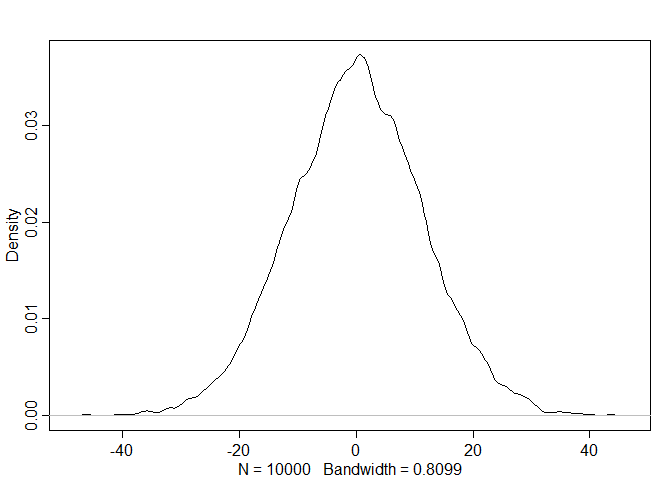

```r
library(rethinking)
```

# Easy 

## 4E1 In the model definition below, which line is the likelihood?
### $y_{i} \sim Normal(\mu, \sigma)$  
### $\mu \sim Normal(0, 10)$  
### $\sigma \sim Uniform(0, 10)$  
$$y_{i} \sim Normal(\mu, \sigma)$$

## 4E2 In the model definition just above, how many parameters are in the posterior distribution?  
There are **two** parameters in the posterior distribution. 

## 4E3 Using the model definition above, write down the appropriate form of Bayes' theorem that includes the proper likelihood and priors.  
$$Pr(\mu, \sigma |y) = \displaystyle \frac{\prod_{i} Normal(y_{i} | \mu, \sigma) Normal(\mu | 0, 10) Uniform(\sigma | 0, 10)}{\int \int \prod_{i} Normal(y_{i} | \mu, \sigma) Normal(\mu | 0, 10), Uniform(\sigma | 0, 10) d\mu d\sigma} $$

## 4E4 In the model definition below, which line is the linear model? 
### $y_{i} \sim Normal(\mu, \sigma)$  
### $\mu_{i} = \alpha + \beta x_{i}$ 
### $\beta \sim Uniform(0, 10)$  
### $\sigma \sim Uniform(0, 10)$  
$$\mu_{i} = \alpha + \beta x_{i}$$

## 4E5 In the model definition just above, how many parameters are in the posterior distribution?  
There are **three** parameters in the posterior distribution. 

# Medium 

## 4M1 For the model definition below, simulate observed heights from the prior (not the posterior).  
### $y_{i} \sim Normal(\mu, \sigma)$  
### $\mu \sim Normal(0, 10)$  
### $\sigma \sim Uniform(0, 10)$  

```r
# sample from the prior
sample_mu <- rnorm(1e4, 0, 10)
sample_sigma <- runif(1e4, 0, 10)
prior_y <- rnorm(1e4, sample_mu, sample_sigma)
dens(prior_y)
```

<!-- -->

## 4M2 Translate the model just above into a `quap` formula.  
```
quap(
  alist(
    y ~ dnorm(mu, sigma),
    mu ~ dnorm(0, 10),
    sigma ~ dunif(0, 10)
  ),
  data = data
)
```

## 4M3 Translate the `quap` model formula below into a mathematical definition. 
```
flist <- alist(
  y ~ dnorm(mu, sigma),
  mu <- a + b*x,
  a ~ dnorm(0, 50),
  b ~ dunif(0, 10),
  sigma ~ dunif(0, 50)
)
```
### $y_{i} \sim Normal(\mu_{i}, \sigma)$
### $\mu_{i} = \alpha + \beta *x_{i}$
### $\alpha \sim Normal(0, 50)$
### $\beta \sim Uniform(0, 10)$
### $\sigma \sim Uniform(0, 50)$
